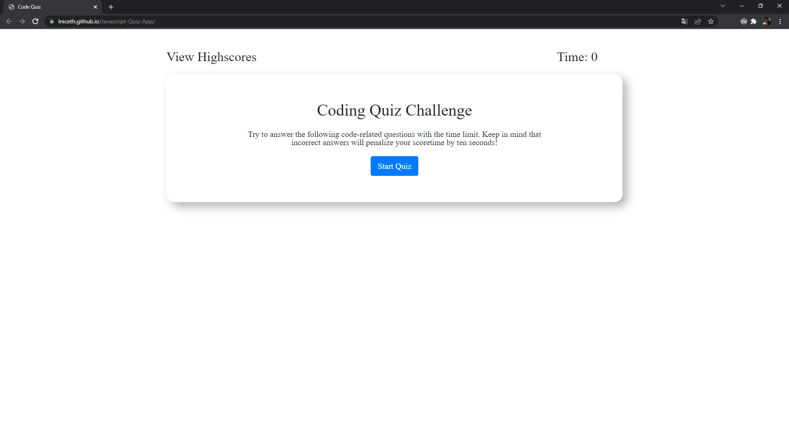
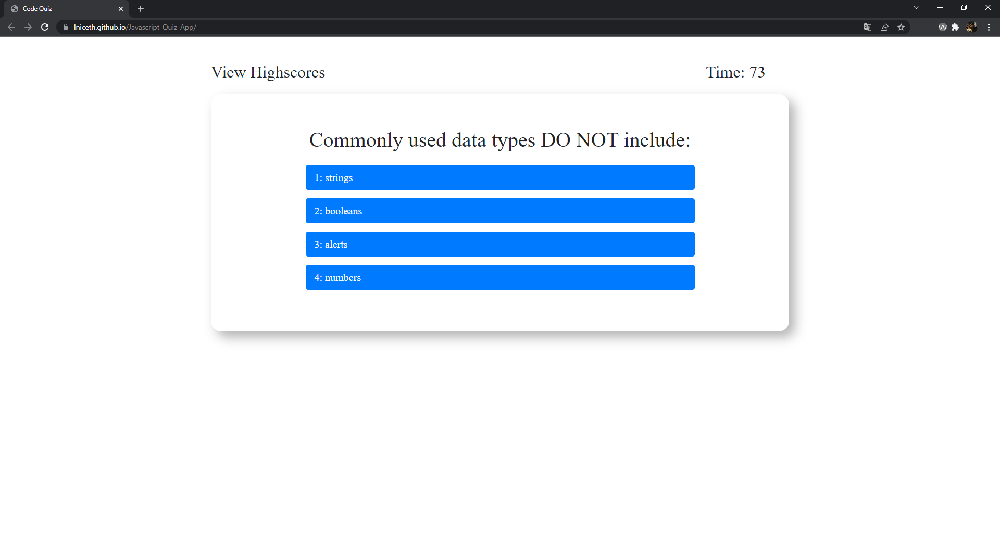
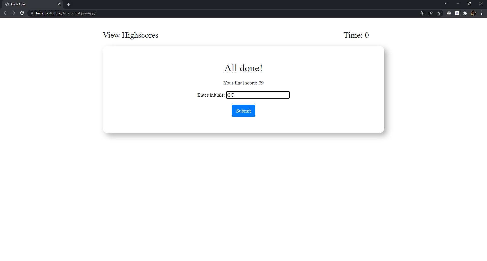
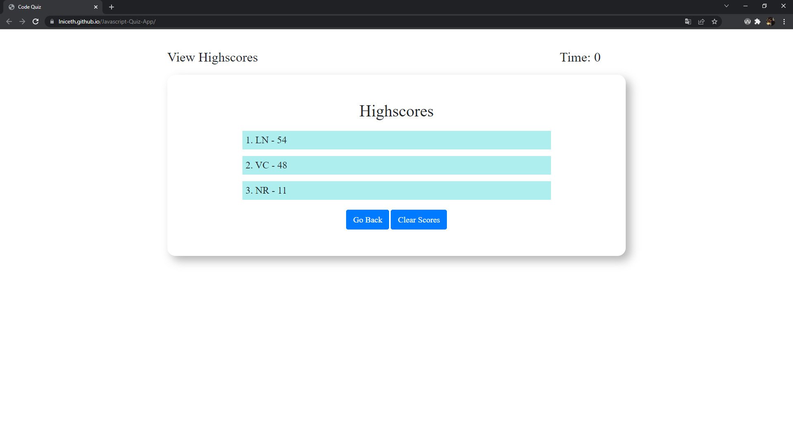

# Code Quiz 📝

git

## Description

This application will test your knowledge of javascript, css and html! Answer the questions under the time alloted. Each correct question will give you 5 points. Every incorrect question will substract 10 seconds from the timer. At the end, any extra time will be added to the final score. At the end you can save your final score and add to the list of high scores.

## Table of Contents

* [Installation](#installation)
* [Usage](#usage)
    * [Screenshots](#screenshots)


## Installation

This application is compatible with the most commonly used web browsers.

<p align="center">
    <a href="https://lniceth.github.io/Javascript-Quiz-App/"></a>
</p>
## Usage

### Screenshots

1. Welcome 



2. Quiz



3. Input Score 




4. High Scores 




### Snippets

1. Submit Score: This event listener is tied to the _submitInitials_ button. Once clicked, it shows most of the manipulation that happens in the local storage. First it trims the value of the input and checks if it's empty. Then, it creates a new object with the user's initials and their score. Then, it retrieves the array of user objects from the local storage if there is one. Then, it pushes the created object to the array and saves it to the local storage. All objects saved to the local storage consist of a _username_, a _userScore_, and their respective values.

```javascript

submitInitialsBtnEl.addEventListener("click", function () {
    let initValue = initialsEl.value.trim();
    if (initValue) {
        let userScore = { username: initValue, userScore: score };
        initialsEl.value = '';
        highScores = JSON.parse(localStorage.getItem("scores")) || [];
        highScores.push(userScore)
        localStorage.setItem("scores", JSON.stringify(highScores));
        hide(inputScoreEl);
        renderHighScores();
        reset();
    }
});

```

2. Timer: This shows the time manipulation that starts as soon as the quiz starts. The _startTimer()_ function starts and updates the timer on the screen every 1000 milliseconds. It also checks every iteration if the time is up so the timer and the quiz can be stopped. The _stopTimer()_ function is called once the time is up or once the user is done with the last question of the quiz.

```javascript

function startTimer() {
    timerEl.textContent = timeGiven;
    interval = setInterval(function () {
        secondsElapsed++;
        timerEl.textContent = timeGiven - secondsElapsed;
        if (secondsElapsed >= timeGiven) {
            currentQ = questions.length;
            nextQuestion();
        }
    }, 1000);
}

function stopTimer() {
    clearInterval(interval);
}
    


